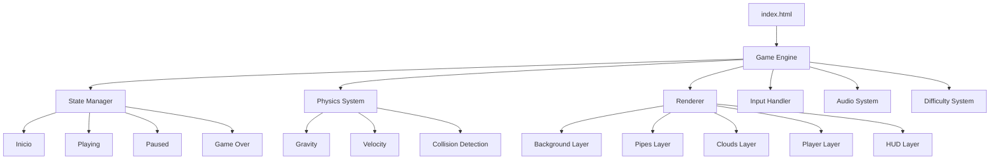
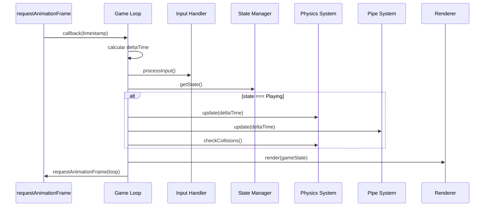
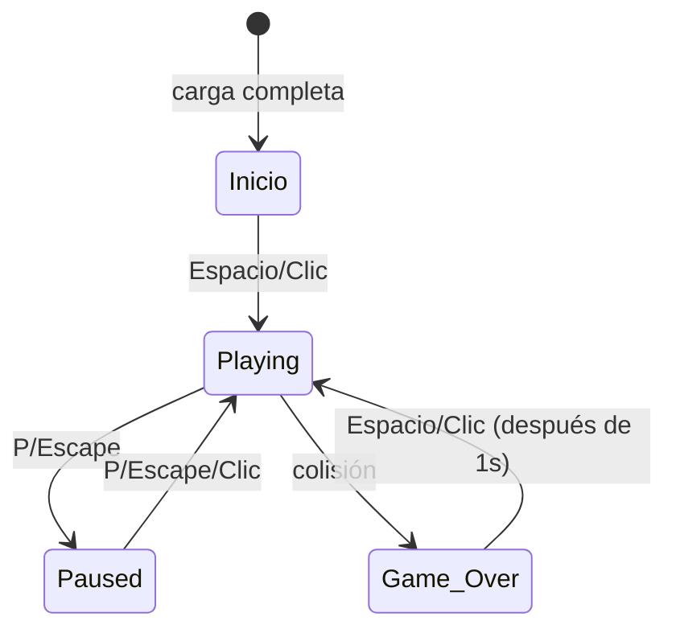
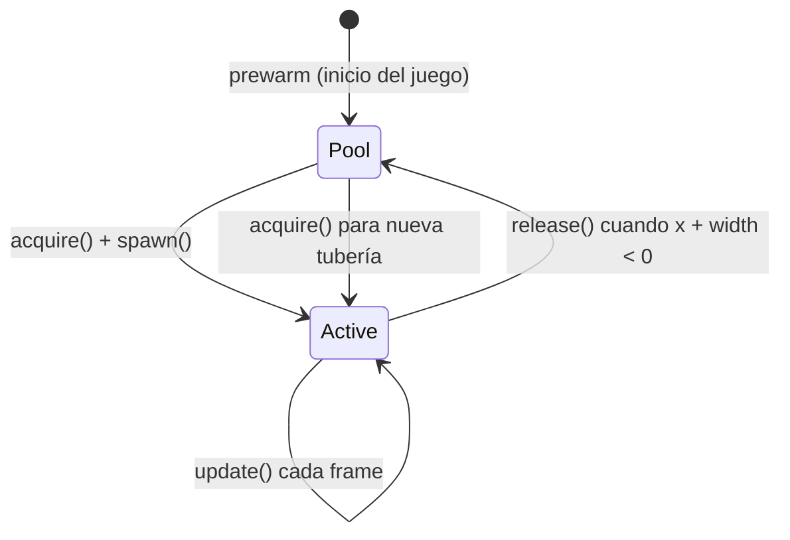

# Documento de Diseño - Flappy Kiro

## Resumen (Overview)

Flappy Kiro es un juego side-scroller infinito estilo Flappy Bird implementado con HTML5 Canvas y JavaScript vanilla, sin dependencias externas. El jugador controla a un fantasmita ("Flappy") que debe navegar a través de pares de tuberías con dificultad progresiva. El juego presenta un fondo con una caricatura de la Ciudad de Panamá con efecto parallax, estilo visual anime/retro, y un sistema de audio con efectos de salto y game over.

El juego se ejecuta directamente en el navegador abriendo un archivo HTML, utiliza `requestAnimationFrame` para el game loop, y persiste el puntaje máximo en `localStorage`.

## Arquitectura

### Patrón Arquitectónico

El juego sigue un patrón **Game Loop** con una arquitectura basada en **sistemas** (Entity-Component-System simplificado). El motor principal orquesta subsistemas independientes que se ejecutan en cada frame.



### Game Loop

El loop principal sigue el ciclo clásico: **Input → Update → Render**, normalizado por delta time.



### Estructura de Archivos

```
/
├── index.html          # Punto de entrada, contiene el canvas y carga el script
├── game.js             # Código completo del juego (archivo único)
├── assets/
│   ├── ghosty.png      # Sprite del personaje Flappy
│   ├── jump.wav        # Efecto de sonido de salto
│   └── game_over.wav   # Efecto de sonido de game over
└── img/
    └── example-ui.png  # Referencia visual del diseño
```

**Decisión de diseño**: Todo el código del juego reside en un solo archivo `game.js` para cumplir con el requisito de ejecutarse sin bundler ni servidor. Internamente se organiza en clases/módulos lógicos usando un patrón de módulo revelador (revealing module) o clases ES6.

## Componentes e Interfaces

### 1. GameEngine (Motor Principal)

Responsable de orquestar el game loop y coordinar todos los subsistemas.

```javascript
class GameEngine {
  constructor(canvas)
  
  // Lifecycle
  init(): Promise<void>          // Carga recursos, inicializa subsistemas
  start(): void                  // Inicia el game loop
  reset(): void                  // Reinicia la partida
  
  // Game Loop
  loop(timestamp: number): void  // Frame principal
  update(deltaTime: number): void
  render(): void
  
  // Properties
  canvas: HTMLCanvasElement
  ctx: CanvasRenderingContext2D
  state: GameState
  lastTimestamp: number
  player: Player
  pipes: PipeSystem
  background: Background
  clouds: CloudSystem
  hud: HUD
  audio: AudioSystem
  input: InputHandler
  difficulty: DifficultySystem
}
```

### 2. Player (Flappy)

Gestiona la física y el estado del personaje. Usa una **hitbox circular** para colisiones más precisas con el sprite redondeado del fantasmita.

```javascript
class Player {
  constructor(spriteImage: HTMLImageElement)
  
  // Physics
  update(deltaTime: number): void
  jump(): void
  applyGravity(deltaTime: number): void
  
  // Collision (circular hitbox)
  getCollisionCircle(): Circle
  
  // Rendering
  render(ctx: CanvasRenderingContext2D): void
  
  // Properties
  x: number              // Posición horizontal fija (20% del canvas)
  y: number              // Posición vertical actual (centro del sprite)
  velocity: number       // Velocidad vertical actual (px/s)
  sprite: HTMLImageElement
  width: number
  height: number
  radius: number         // Radio de colisión (basado en el sprite)
  
  // Constants
  static GRAVITY: 980           // px/s²
  static JUMP_IMPULSE: -300     // px/s
  static TERMINAL_VELOCITY: 500 // px/s max descenso
  static MAX_UP_VELOCITY: -300  // px/s max ascenso
  static HITBOX_RADIUS_FACTOR: 0.4  // Radio = min(width, height) * factor
}
```

### 3. PipeSystem (Sistema de Tuberías)

Genera, desplaza y elimina pares de tuberías. Usa **object pooling** para evitar allocations durante gameplay.

```javascript
class PipeSystem {
  constructor(pool: PipePool)
  
  update(deltaTime: number, speed: number, gap: number, spacing: number): void
  render(ctx: CanvasRenderingContext2D, batchRenderer: BatchRenderer): void
  reset(): void
  checkScore(playerX: number): { scored: boolean }
  getActivePipes(): Pipe[]
  
  // Properties
  pool: PipePool          // Pool de objetos reutilizables
  activePipes: Pipe[]     // Tuberías actualmente en pantalla
  lastPipeX: number       // Posición X de la última tubería generada
  
  static PIPE_WIDTH: 60   // px
}

interface Pipe {
  x: number
  gapCenterY: number
  gapSize: number
  scored: boolean       // Si el jugador ya pasó esta tubería
  topRect: Rect         // Hitbox tubería superior
  bottomRect: Rect      // Hitbox tubería inferior
  active: boolean       // Si está en uso o disponible en el pool
}
```

### 4. DifficultySystem (Dificultad Progresiva)

Calcula los parámetros de dificultad basados en el puntaje.

```javascript
class DifficultySystem {
  constructor()
  
  update(score: number): void
  reset(): void
  
  // Properties (valores actuales calculados)
  speed: number         // Velocidad actual de tuberías (px/s)
  gap: number           // Tamaño actual del gap (px)
  spacing: number       // Distancia horizontal entre pares (px)
  
  // Constants
  static BASE_SPEED: 150        // px/s
  static MAX_SPEED_MULTIPLIER: 2.0
  static SPEED_INCREMENT: 0.05  // +5% cada 5 puntos
  static BASE_GAP: 160          // px
  static MIN_GAP: 100           // px
  static GAP_REDUCTION: 5       // px cada 10 puntos
  static BASE_SPACING: 250      // px
  static MIN_SPACING: 180       // px
  static SPACING_REDUCTION: 10  // px cada 10 puntos
}
```

### 5. Background (Fondo de Ciudad de Panamá)

Renderiza el fondo con efecto parallax.

```javascript
class Background {
  constructor(canvasWidth: number, canvasHeight: number)
  
  update(deltaTime: number, pipeSpeed: number): void
  render(ctx: CanvasRenderingContext2D): void
  
  // Properties
  scrollX: number       // Offset de desplazamiento actual
  
  static PARALLAX_FACTOR: 0.3  // 30% de la velocidad de tuberías
}
```

### 6. CloudSystem (Nubes Decorativas)

Gestiona nubes con parallax multicapa.

```javascript
class CloudSystem {
  constructor(canvasWidth: number, canvasHeight: number)
  
  update(deltaTime: number, pipeSpeed: number): void
  render(ctx: CanvasRenderingContext2D): void
  
  // Properties
  clouds: Cloud[]
  
  static MIN_CLOUDS: 3
  static MIN_SPEED_FACTOR: 0.1  // 10% velocidad tuberías
  static MAX_SPEED_FACTOR: 0.5  // 50% velocidad tuberías
  static MIN_OPACITY: 0.4
  static MAX_OPACITY: 0.7
}

interface Cloud {
  x: number
  y: number
  width: number
  height: number
  speedFactor: number   // Factor de velocidad relativo a tuberías
  opacity: number       // Entre 0.4 y 0.7
}
```

### 7. HUD (Interfaz de Usuario)

Renderiza la información de puntaje y estado.

```javascript
class HUD {
  constructor()
  
  render(ctx: CanvasRenderingContext2D, state: GameState, score: number, highScore: number): void
  
  static BAR_HEIGHT: 40         // px
  static BAR_COLOR: 'rgba(0, 0, 0, 0.8)'
}
```

### 8. AudioSystem (Sistema de Audio)

Gestiona la carga y reproducción de efectos de sonido.

```javascript
class AudioSystem {
  constructor()
  
  init(): Promise<void>
  playJump(): void
  playGameOver(): void
  unlock(): void        // Desbloquea AudioContext en primera interacción
  
  // Properties
  jumpSound: AudioBuffer
  gameOverSound: AudioBuffer
  audioContext: AudioContext
  unlocked: boolean
}
```

### 9. InputHandler (Manejo de Entrada)

Captura y procesa eventos de teclado y mouse.

```javascript
class InputHandler {
  constructor(canvas: HTMLCanvasElement)
  
  bind(): void
  unbind(): void
  
  // Callbacks (asignados por GameEngine)
  onJump: () => void
  onPause: () => void
  onResume: () => void
  onRestart: () => void
}
```

### 10. StateManager (Gestor de Estado)

Controla las transiciones entre estados del juego.

```javascript
class StateManager {
  constructor()
  
  transition(newState: GameState): boolean
  getState(): GameState
  getTimeInState(): number
  
  // Properties
  currentState: GameState
  stateEnteredAt: number  // timestamp de entrada al estado actual
}

enum GameState {
  INICIO = 'inicio',
  PLAYING = 'playing',
  PAUSED = 'paused',
  GAME_OVER = 'game_over'
}
```

### 11. ScoreSystem (Sistema de Puntuación)

Gestiona el puntaje y la persistencia en localStorage.

```javascript
class ScoreSystem {
  constructor()
  
  increment(): void
  reset(): void
  loadHighScore(): number
  saveHighScore(): void
  
  // Properties
  score: number
  highScore: number
  
  static MAX_SCORE: 9999
  static STORAGE_KEY: 'flappy_kiro_high_score'
}
```

## Modelos de Datos

### Tipos Compartidos

```javascript
/**
 * Rectángulo para hitboxes de tuberías y posicionamiento
 */
interface Rect {
  x: number       // Esquina superior izquierda
  y: number       // Esquina superior izquierda
  width: number
  height: number
}

/**
 * Círculo para hitbox del jugador (Ghosty)
 */
interface Circle {
  cx: number      // Centro X
  cy: number      // Centro Y
  radius: number  // Radio de colisión
}

/**
 * Detección de colisión círculo vs rectángulo.
 * Encuentra el punto más cercano del rectángulo al centro del círculo,
 * luego verifica si la distancia es menor o igual al radio.
 */
function circleRectCollision(circle: Circle, rect: Rect): boolean {
  const nearestX = Math.max(rect.x, Math.min(circle.cx, rect.x + rect.width));
  const nearestY = Math.max(rect.y, Math.min(circle.cy, rect.y + rect.height));
  const dx = circle.cx - nearestX;
  const dy = circle.cy - nearestY;
  return (dx * dx + dy * dy) <= (circle.radius * circle.radius);
}

/**
 * Detección de colisión con límites (suelo/techo) usando hitbox circular.
 */
function checkBoundaryCollision(circle: Circle, canvasHeight: number): boolean {
  return circle.cy - circle.radius <= 0 || circle.cy + circle.radius >= canvasHeight;
}

/**
 * Configuración del juego (constantes)
 */
const GAME_CONFIG = {
  // Canvas
  BASE_WIDTH: 800,
  BASE_HEIGHT: 600,
  ASPECT_RATIO: 4/3,
  
  // Player
  PLAYER_X_PERCENT: 0.20,    // 20% del ancho
  GRAVITY: 980,              // px/s²
  JUMP_IMPULSE: -300,        // px/s
  TERMINAL_VELOCITY: 500,    // px/s
  MAX_UP_VELOCITY: -300,     // px/s
  HITBOX_RADIUS_FACTOR: 0.4, // Radio = min(width, height) * factor
  
  // Pipes
  PIPE_WIDTH: 60,            // px
  BASE_SPEED: 150,           // px/s
  BASE_GAP: 160,             // px
  BASE_SPACING: 250,         // px
  MIN_GAP: 100,              // px
  MIN_SPACING: 180,          // px
  MAX_SPEED_MULTIPLIER: 2.0,
  
  // Difficulty increments
  SPEED_INCREMENT_INTERVAL: 5,    // cada 5 puntos
  SPEED_INCREMENT_PERCENT: 0.05,  // +5%
  GAP_REDUCTION_INTERVAL: 10,     // cada 10 puntos
  GAP_REDUCTION_PX: 5,            // -5px
  SPACING_REDUCTION_INTERVAL: 10, // cada 10 puntos
  SPACING_REDUCTION_PX: 10,       // -10px
  
  // Background
  BG_PARALLAX_FACTOR: 0.3,
  SKY_COLOR: '#87CEEB',
  
  // Clouds
  MIN_CLOUDS: 3,
  CLOUD_MIN_SPEED: 0.1,
  CLOUD_MAX_SPEED: 0.5,
  CLOUD_MIN_OPACITY: 0.4,
  CLOUD_MAX_OPACITY: 0.7,
  
  // Score
  MAX_SCORE: 9999,
  STORAGE_KEY: 'flappy_kiro_high_score',
  
  // Game Over
  RESTART_DELAY_MS: 1000,
  
  // Asset loading
  ASSET_TIMEOUT_MS: 10000,
  
  // Performance & Pooling
  TARGET_FPS: 60,
  DEGRADATION_THRESHOLD_FPS: 45,
  PIPE_POOL_INITIAL_SIZE: 10,
  CLOUD_POOL_INITIAL_SIZE: 6,
  USE_OFFSCREEN_CANVAS: true,
  FPS_SAMPLE_SIZE: 60,
  
  // Audio
  AUDIO_FILES: ['assets/jump.wav', 'assets/game_over.wav'],
  SPRITE_FILE: 'assets/ghosty.png'
}
```

### Estado del Juego (Runtime)

```javascript
/**
 * Estado completo del juego en un frame dado
 */
interface GameSnapshot {
  state: GameState
  score: number
  highScore: number
  player: {
    x: number
    y: number
    velocity: number
  }
  pipes: Pipe[]
  difficulty: {
    speed: number
    gap: number
    spacing: number
  }
  deltaTime: number
  timestamp: number
}
```

### Transiciones de Estado Válidas



| Estado Actual | Entrada | Estado Siguiente | Condición |
|---|---|---|---|
| Inicio | Espacio/Clic | Playing | Recursos cargados |
| Playing | P/Escape | Paused | — |
| Playing | Colisión | Game_Over | AABB overlap o fuera de límites |
| Paused | P/Escape/Clic | Playing | — |
| Game_Over | Espacio/Clic | Playing (reset) | ≥1 segundo en Game_Over |

## Correctness Properties

*A property is a characteristic or behavior that should hold true across all valid executions of a system—essentially, a formal statement about what the system should do. Properties serve as the bridge between human-readable specifications and machine-verifiable correctness guarantees.*

### Property 1: Physics Update Correctness

*For any* initial velocity `v`, position `y`, and positive delta time `dt`, after a physics update without jump input, the new velocity should equal `v + 980 * dt` (clamped to velocity bounds) and the new position should equal `y + newVelocity * dt`.

**Validates: Requirements 2.1, 2.6, 2.8**

### Property 2: Jump Impulse Override

*For any* current vertical velocity (positive or negative), when a jump is executed, the resulting velocity should be exactly -300 px/s regardless of the previous velocity value.

**Validates: Requirements 2.2**

### Property 3: Velocity Bounds Invariant

*For any* sequence of physics updates and jump inputs applied to the player, the vertical velocity should always remain within the range [-300, 500] px/s inclusive.

**Validates: Requirements 2.3, 2.4**

### Property 4: Linear Interpolation Correctness

*For any* previous position `a`, current position `b`, and interpolation factor `alpha` in [0, 1], the lerp result should equal `a + (b - a) * alpha` and should always be between `min(a, b)` and `max(a, b)` inclusive.

**Validates: Requirements 2.5**

### Property 5: Player Horizontal Position Invariant

*For any* canvas width, the player's horizontal position should always equal exactly 20% of the canvas width, regardless of game state or elapsed time.

**Validates: Requirements 2.7**

### Property 6: Difficulty Scaling Correctness

*For any* score value between 0 and 9999, the difficulty parameters should be:
- Speed = min(150 * (1 + floor(score/5) * 0.05), 300) px/s
- Gap = max(160 - floor(score/10) * 5, 100) px
- Spacing = max(250 - floor(score/10) * 10, 180) px

And speed should never exceed 300, gap should never be less than 100, and spacing should never be less than 180.

**Validates: Requirements 3.7, 3.8, 3.9**

### Property 7: Pipe Gap Center Range

*For any* generated pipe pair and any canvas height, the vertical center of the gap should be positioned between 20% and 80% of the canvas height inclusive.

**Validates: Requirements 3.3**

### Property 8: Pipe Movement and Cleanup

*For any* set of active pipes after an update with positive delta time and positive speed, each pipe's X position should decrease by exactly `speed * dt`, and no pipe with `x + PIPE_WIDTH < 0` should remain in the active pipes array.

**Validates: Requirements 3.4, 3.5**

### Property 9: Circle-Rectangle Collision Detection

*For any* circle (center cx, cy, radius r) and axis-aligned rectangle (x, y, width, height), the collision function should return true if and only if the distance from the circle's center to the nearest point on the rectangle is less than or equal to the circle's radius. The nearest point is calculated as `(clamp(cx, x, x+width), clamp(cy, y, y+height))`.

**Validates: Requirements 4.1**

### Property 10: Boundary Collision Detection (Ground/Ceiling)

*For any* player circle (center cy, radius r) and canvas height, a ceiling collision should be detected if and only if `cy - r <= 0`, and a ground collision should be detected if and only if `cy + r >= canvasHeight`.

**Validates: Requirements 4.2, 4.3**

### Property 11: Score Increment and Cap

*For any* current score between 0 and 9999, incrementing the score should produce `min(score + 1, 9999)`. The score should never exceed 9999.

**Validates: Requirements 6.1**

### Property 12: High Score Persistence Round-Trip

*For any* valid high score value (integer 0-9999), saving to localStorage and then loading should return the same value. For any invalid localStorage content (non-numeric, negative, > 9999, null, undefined), loading should return 0.

**Validates: Requirements 6.4, 6.5, 6.6**

### Property 13: State Freeze in Non-Playing States

*For any* complete game state (player position, velocity, pipe positions, background scroll, cloud positions) while in Paused or Game_Over state, calling update with any positive delta time should produce no change to any position or velocity value.

**Validates: Requirements 7.3, 7.7**

### Property 14: Pause/Resume Round-Trip

*For any* game state in Playing mode, transitioning to Paused and then back to Playing should preserve the exact player position, player velocity, pipe positions, score, and difficulty parameters without any modification.

**Validates: Requirements 7.5, 7.6**

### Property 15: Game Over Time Gate

*For any* game in Game_Over state, if the time elapsed since entering Game_Over is less than 1000ms, any restart input (Space/Click) should be ignored and the state should remain Game_Over. If the time elapsed is >= 1000ms, restart input should transition to Playing with score=0 and initial difficulty.

**Validates: Requirements 7.9, 7.11**

### Property 16: Reset Completeness

*For any* game state (regardless of score, difficulty, player position, or pipe configuration), after a reset operation, the game state should match the initial configuration: score=0, velocity=0, player at initial Y position, no pipes, difficulty at base values (speed=150, gap=160, spacing=250), and high score preserved from localStorage.

**Validates: Requirements 7.10**

### Property 17: Background Parallax and Wrapping

*For any* pipe speed and positive delta time, the background should scroll at exactly 30% of the pipe speed. For any scroll offset, the rendered background position should wrap seamlessly (scrollX modulo background width produces a valid render offset in [0, backgroundWidth)).

**Validates: Requirements 8.3, 8.4**

### Property 18: Cloud System Invariants

*For any* cloud system state, there should be at least 3 clouds, each cloud's opacity should be in [0.4, 0.7], each cloud's speed factor should be in [0.1, 0.5] relative to pipe speed, and not all clouds should have the same speed factor.

**Validates: Requirements 9.2, 9.3**

### Property 19: Canvas Aspect Ratio Scaling

*For any* window dimensions (width, height), the scaled canvas dimensions should maintain a 4:3 aspect ratio (width/height = 4/3 within floating point tolerance) and should fit within the available window space without exceeding it.

**Validates: Requirements 9.7**

## Directrices de Optimización de Rendimiento

### Objetivo: 60 FPS Consistentes

El juego debe mantener 60 FPS como objetivo primario. Se considera degradación aceptable hasta 30 FPS en hardware limitado, pero el diseño debe optimizar para evitarlo.

```javascript
// Monitoreo de rendimiento integrado en el game loop
class PerformanceMonitor {
  constructor()
  
  beginFrame(): void
  endFrame(): void
  getFPS(): number
  getAverageFrameTime(): number
  isPerformanceDegraded(): boolean  // true si FPS < 45 por más de 10 frames
  
  // Properties
  frameCount: number
  frameTimes: number[]        // Ring buffer de últimos 60 frame times
  lastFPS: number
  
  static TARGET_FPS: 60
  static DEGRADATION_THRESHOLD: 45
  static SAMPLE_SIZE: 60
}
```

**Estrategias para mantener 60 FPS:**
- Minimizar allocations dentro del game loop (zero-alloc en hot path)
- Usar `requestAnimationFrame` sin trabajo adicional entre frames
- Limitar operaciones de Canvas a las estrictamente necesarias por frame
- Evitar `getImageData`/`putImageData` en el loop principal

### Procesamiento por Lotes de Sprites (Sprite Batching)

En lugar de llamar a `ctx.drawImage()` individualmente para cada elemento, el renderer agrupa las operaciones de dibujo por tipo para minimizar cambios de estado del contexto Canvas.

```javascript
class BatchRenderer {
  constructor(ctx: CanvasRenderingContext2D)
  
  // Agrupa draws por estado de contexto similar
  beginBatch(): void
  drawSprite(image: HTMLImageElement, x: number, y: number, w: number, h: number): void
  drawRect(x: number, y: number, w: number, h: number, fillStyle: string): void
  flushBatch(): void
  
  // Pre-renderizado de elementos estáticos en offscreen canvas
  prerenderPipeSegment(width: number, height: number, style: string): HTMLCanvasElement
  prerenderCloud(width: number, height: number, opacity: number): HTMLCanvasElement
  
  // Properties
  pipeCache: Map<string, HTMLCanvasElement>   // Cache de segmentos pre-renderizados
  cloudCache: Map<string, HTMLCanvasElement>  // Cache de nubes pre-renderizadas
}
```

**Principios de batching:**

1. **Agrupar por fillStyle/strokeStyle**: Todas las tuberías comparten el mismo estilo, se dibujan en secuencia sin cambiar `ctx.fillStyle` entre cada una
2. **Pre-renderizar en OffscreenCanvas**: Los segmentos de tubería y las nubes se dibujan una vez en canvas offscreen y luego se copian con `drawImage()` (más rápido que redibujar formas complejas cada frame)
3. **Minimizar cambios de estado**: El orden de renderizado (fondo → tuberías → nubes → player → HUD) ya agrupa elementos con estilos similares
4. **Evitar `save()`/`restore()` innecesarios**: Solo usar cuando se requiere transformación (rotación del sprite de Flappy)

```javascript
// Ejemplo: pre-renderizado de tubería en offscreen canvas
function createPipeCanvas(width, height, color, borderColor) {
  const offscreen = document.createElement('canvas');
  offscreen.width = width;
  offscreen.height = height;
  const octx = offscreen.getContext('2d');
  octx.fillStyle = color;
  octx.fillRect(0, 0, width, height);
  octx.strokeStyle = borderColor;
  octx.lineWidth = 2;
  octx.strokeRect(0, 0, width, height);
  return offscreen; // Reutilizar con drawImage() cada frame
}
```

### Gestión de Memoria: Object Pooling para Obstáculos

Las tuberías se reciclan en lugar de crear/destruir objetos cada vez que salen de pantalla. Esto elimina la presión sobre el garbage collector y evita micro-stutters.

```javascript
class ObjectPool {
  constructor(factory: () => T, initialSize: number)
  
  acquire(): T          // Obtiene un objeto del pool (o crea uno nuevo si está vacío)
  release(obj: T): void // Devuelve un objeto al pool para reutilización
  prewarm(count: number): void  // Pre-crea objetos al inicio
  getActiveCount(): number
  getPoolSize(): number
  
  // Properties
  pool: T[]             // Objetos disponibles para reutilización
  active: Set<T>        // Objetos actualmente en uso
}

// Pool específico para tuberías
class PipePool extends ObjectPool<Pipe> {
  constructor() {
    super(() => ({
      x: 0,
      gapCenterY: 0,
      gapSize: 0,
      scored: false,
      topRect: { x: 0, y: 0, width: 0, height: 0 },
      bottomRect: { x: 0, y: 0, width: 0, height: 0 },
      active: false
    }), INITIAL_POOL_SIZE);
  }
  
  // Reconfigura un pipe reciclado con nuevos valores
  spawn(x: number, gapCenterY: number, gapSize: number): Pipe
  
  static INITIAL_POOL_SIZE: 10  // Pre-crear 10 pares de tuberías
}
```

**Ciclo de vida de un obstáculo con pooling:**



**Reglas del pool:**
1. Al inicio del juego, pre-crear `INITIAL_POOL_SIZE` (10) objetos de tubería
2. Cuando una tubería sale de pantalla, llamar `release()` en vez de eliminarla del array
3. Cuando se necesita una nueva tubería, llamar `acquire()` y reconfigurar con `spawn()`
4. Si el pool está vacío (caso raro), crear un objeto nuevo dinámicamente
5. Nunca reducir el pool — los objetos creados persisten toda la sesión

**Beneficios medibles:**
- Zero garbage collection pauses durante gameplay
- Allocations solo ocurren durante `prewarm()` al inicio
- Memoria estable y predecible (~10 objetos pipe × ~100 bytes = ~1KB fijo)

### Configuración de Rendimiento en GAME_CONFIG

```javascript
// Agregar a GAME_CONFIG:
const GAME_CONFIG = {
  // ... existing config ...
  
  // Performance
  TARGET_FPS: 60,
  DEGRADATION_THRESHOLD_FPS: 45,
  MAX_DELTA_TIME: 1/30,           // Clamp para tabs inactivos
  PIPE_POOL_INITIAL_SIZE: 10,     // Objetos pre-creados
  CLOUD_POOL_INITIAL_SIZE: 6,     // Nubes pre-creadas
  USE_OFFSCREEN_CANVAS: true,     // Pre-renderizar sprites estáticos
  FPS_SAMPLE_SIZE: 60,            // Frames para calcular FPS promedio
}
```

## Error Handling

### Asset Loading Failures

| Escenario | Comportamiento |
|---|---|
| ghosty.png no carga en 10s | Mostrar mensaje de error, no iniciar juego |
| jump.wav no carga en 10s | Mostrar mensaje de error, no iniciar juego |
| game_over.wav no carga en 10s | Mostrar mensaje de error, no iniciar juego |
| Carga parcial (imagen OK, audio falla) | Mostrar error, no iniciar |

**Implementación**: Usar `Promise.race` con un timeout de 10 segundos contra las promesas de carga de recursos. Si el timeout gana, renderizar un mensaje de error en el canvas.

### Audio Context Bloqueado

| Escenario | Comportamiento |
|---|---|
| AudioContext en estado "suspended" | Continuar juego sin sonido |
| Primera interacción del usuario | Llamar `audioContext.resume()` |
| resume() exitoso | Habilitar reproducción de sonidos |
| resume() falla | Continuar sin sonido silenciosamente |

**Implementación**: Verificar `audioContext.state` antes de reproducir. En la primera interacción (click/keydown), intentar `resume()`. Envolver toda reproducción en try/catch.

### localStorage No Disponible

| Escenario | Comportamiento |
|---|---|
| localStorage no existe (modo privado) | Usar highScore=0, no persistir |
| localStorage.getItem lanza excepción | Usar highScore=0, no persistir |
| Valor almacenado no es número válido | Usar highScore=0, sobrescribir en próximo save |
| Valor almacenado es negativo o > 9999 | Usar highScore=0, sobrescribir |
| localStorage.setItem lanza excepción (cuota) | Ignorar silenciosamente, continuar juego |

**Implementación**: Envolver todas las operaciones de localStorage en try/catch. Validar con `parseInt` y verificar rango [0, 9999].

### Delta Time Anómalo

| Escenario | Comportamiento |
|---|---|
| deltaTime > 1 segundo (tab inactivo) | Limitar deltaTime a un máximo de 1/30 segundo |
| deltaTime = 0 | Saltar frame de actualización |
| deltaTime negativo | Saltar frame de actualización |

**Implementación**: Clamp deltaTime a `Math.min(dt, 1/30)` para evitar que el jugador "salte" a través de obstáculos cuando el tab vuelve a estar activo.

### Colisiones en Frames con Alto DeltaTime

| Escenario | Comportamiento |
|---|---|
| Flappy se mueve más de su altura en un frame | El clamp de deltaTime previene esto |
| Tubería se mueve más de su ancho en un frame | El clamp de deltaTime previene esto |

## Testing Strategy

### Enfoque Dual de Testing

El proyecto utiliza un enfoque dual complementario:

1. **Tests de Propiedades (Property-Based Tests)**: Verifican propiedades universales con 100+ iteraciones por propiedad usando entradas generadas aleatoriamente.
2. **Tests Unitarios (Example-Based)**: Verifican ejemplos específicos, edge cases, y comportamiento de integración entre componentes.

### Framework de Testing

- **Test Runner**: Vitest (compatible con ejecución sin servidor, soporte ESM nativo)
- **Property-Based Testing Library**: fast-check (integración nativa con Vitest)
- **Configuración**: Mínimo 100 iteraciones por test de propiedad

### Estructura de Tests

```
tests/
├── properties/
│   ├── physics.property.test.js      # Properties 1-5
│   ├── difficulty.property.test.js   # Property 6
│   ├── pipes.property.test.js        # Properties 7-8
│   ├── collision.property.test.js    # Properties 9-10
│   ├── score.property.test.js        # Properties 11-12
│   ├── state.property.test.js        # Properties 13-16
│   ├── background.property.test.js   # Property 17
│   ├── clouds.property.test.js       # Property 18
│   └── scaling.property.test.js      # Property 19
├── unit/
│   ├── game-engine.test.js           # Inicialización, game loop
│   ├── input-handler.test.js         # Eventos de teclado/mouse
│   ├── audio-system.test.js          # Reproducción, autoplay
│   ├── hud.test.js                   # Formato de texto, posicionamiento
│   ├── renderer.test.js              # Orden de capas, estilos
│   └── state-manager.test.js         # Transiciones de estado
└── edge-cases/
    ├── asset-loading.test.js         # Timeouts, fallos de carga
    ├── localStorage.test.js          # Datos inválidos, no disponible
    └── delta-time.test.js            # Valores anómalos
```

### Configuración de Property Tests

Cada test de propiedad debe:
- Ejecutar mínimo 100 iteraciones
- Referenciar la propiedad del documento de diseño en un comentario
- Usar el formato de tag: `Feature: flappy-kiro, Property {number}: {title}`

```javascript
// Ejemplo de estructura de test de propiedad
import { fc } from 'fast-check';
import { test } from 'vitest';

test('Feature: flappy-kiro, Property 3: Velocity Bounds Invariant', () => {
  fc.assert(
    fc.property(
      fc.array(fc.oneof(
        fc.record({ type: fc.constant('update'), dt: fc.float({ min: 0.001, max: 0.033 }) }),
        fc.record({ type: fc.constant('jump') })
      ), { minLength: 1, maxLength: 100 }),
      (actions) => {
        let velocity = 0;
        for (const action of actions) {
          if (action.type === 'jump') velocity = -300;
          else velocity = Math.min(Math.max(velocity + 980 * action.dt, -300), 500);
        }
        return velocity >= -300 && velocity <= 500;
      }
    ),
    { numRuns: 100 }
  );
});
```

### Tests Unitarios (Example-Based)

Los tests unitarios cubren:
- **Inicialización**: Pantalla de inicio muestra título y texto correcto
- **Transiciones de estado**: Cada transición válida produce el estado esperado
- **Audio**: jump.wav se reproduce al saltar, game_over.wav al colisionar, silencio en pausa
- **HUD**: Formato "Score: X" y "High: X" correcto
- **Rendering**: Orden de capas correcto (cielo → ciudad → tuberías → nubes → Flappy → HUD)
- **Pipe rendering**: Ancho de 60px, color verde, bordes oscuros

### Edge Case Tests

- Asset timeout (10 segundos sin carga → mensaje de error)
- localStorage con valores inválidos (NaN, negativo, > 9999, string)
- DeltaTime anómalo (> 1s, 0, negativo)
- Múltiples saltos rápidos (audio concurrente)
- Resize de ventana a dimensiones extremas

